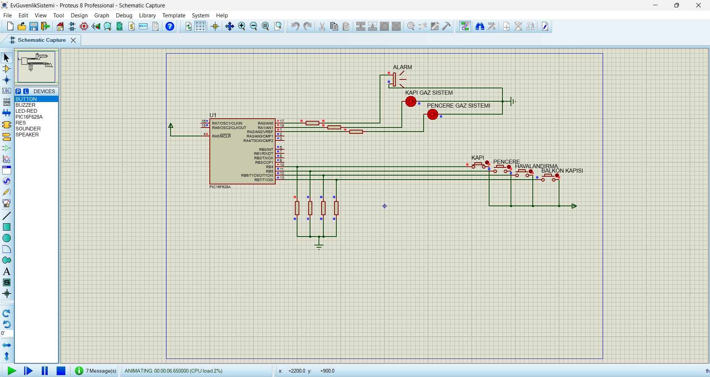

# Simulation

# PIC16F628A Security System

Security alarm system using PIC16F628A (Assembly & Proteus)

## Project Description

This project is a basic security alarm system developed using PIC16F628A microcontroller.

The system detects input signals from security sensors and activates alarm outputs when a trigger condition occurs.

---

## ⚙️ Features

- Sensor-based security control
- Alarm output activation
- LED status indicators
- Buzzer / warning output logic
- Proteus circuit simulation

---

## Working Logic

- RA0 → Security sensor input
- RA1 → Reset / control input
- RB0 → Alarm LED output
- RB1 → Buzzer / alarm output

- When the sensor input is triggered:
  - System activates alarm state
  - Warning LED turns on
  - Buzzer output becomes active

---

## Technologies Used

- PIC16F628A
- Assembly (MPASM)
- Proteus

---

## ▶️ How to Run

1. Open Proteus project file
2. Load `.hex` file into PIC16F628A
3. Start simulation
4. Use the input button/sensor to trigger the alarm

---

## Project Structure

- `code/` → Assembly code
- `proteus/` → Circuit design
- `hex/` → Compiled file
